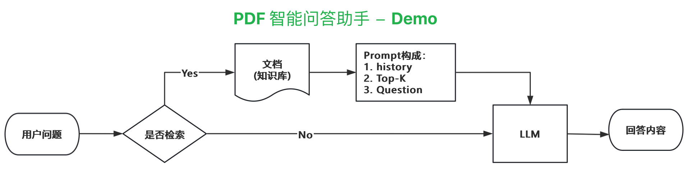
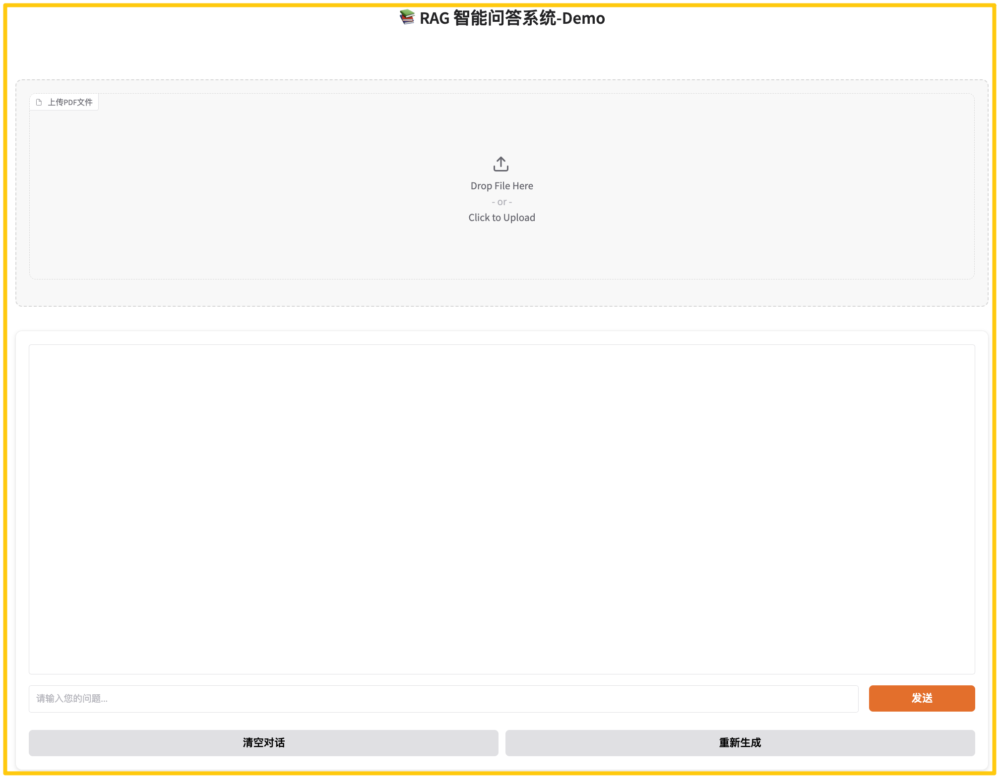

# DeepSeek R1 RAG智能问答系统



基于RAG(检索增强生成)架构的智能问答系统,支持PDF文档的智能问答。本系统使用Ollama作为大语言模型后端,通过向量检索增强文档问答能力。

# 系统界面预览




## 1. 功能特点

- 📚 支持PDF文档上传和智能问答
- 🔍 基于FAISS的高效向量检索
- 🤖 集成Ollama大语言模型
- 🌐 友好的Web交互界面(基于Gradio)
- 🚀 异步处理提升性能
- 📝 完善的日志记录
- 🔒 Docker容器化部署


## 2.系统架构

- **前端**: Gradio提供Web交互界面
- **后端**: 
  - Langchain框架处理文档和LLM交互
  - FAISS向量数据库存储文档向量
  - Ollama提供LLM服务


## 3.环境要求

- Docker & Docker Compose
- Python 3.12+
- 24GB RAM建议


## 4.项目结构
```shell
.
├── config/ # 配置文件
├── core/ # 核心功能模块
│ ├── llm_service.py # LLM服务
│ ├── pdf_processor.py # PDF处理
│ └── vector_store.py # 向量存储
├── utils/ # 工具函数
├── fronted/ # Web界面
├── logs/ # 日志文件
├── vector_db/ # 向量数据库
├── Dockerfile # Docker构建文件
├── docker-compose.yml # Docker编排文件
└── requirements.txt # 依赖包
```


## 5.启动服务
```bash
# 赋予权限
chmod +x start.sh stop.sh

# 启动所有服务
./start.sh

# 进入ollama容器内，并下载模型
docker exec -it ollama /bin/bash  
ollama run deepseek-r1:7b

# 关闭服务
./stop.sh
```


## 6.访问界面
访问 http://localhost:8804 使用RAG智能问答系统


## 7.性能优化
- 使用异步处理提升并发性能
- 向量检索优化
- 文档分块策略优化
- 多线程处理PDF文档


## 8.部署说明
系统使用Docker Compose进行容器化部署:

1. RAGChat服务容器
2. Ollama服务容器

网络配置:
- 内部网络: ragchat-network
- 端口映射: 8804(RAGChat), 11434(Ollama)